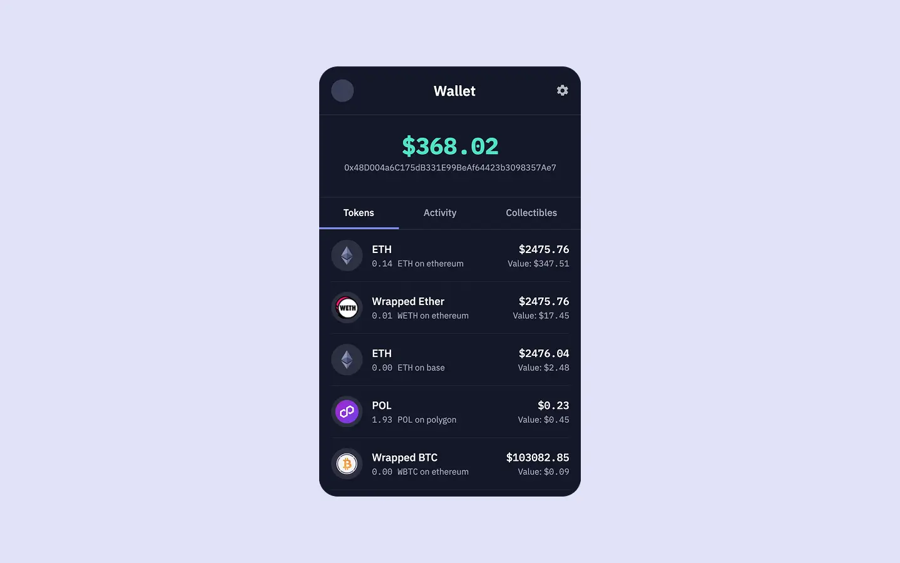

# Sim Realtime Wallet UI

A modern, accessible, and responsive wallet interface for viewing crypto assets and transactions. This example demonstrates a simple integration with Dune's Sim APIs to build a basic wallet user interface.

To read the full guide, visit [https://docs.sim.dune.com/evm/build-a-realtime-wallet](https://docs.sim.dune.com/evm/build-a-realtime-wallet).



## Features

- 💰 View total wallet balance
- 🪙 List and track token balances
- 📊 View transaction history
- 🖼️ NFT/Collectibles support
- 🌙 Dark mode by default
- 📱 Responsive design

## Prerequisites

- Node.js >= 18.0.0
- A Sim API key

## Getting Started

1. Clone the repository
2. Navigate to the wallet-ui directory:
   ```bash
   cd wallet-ui
   ```
3. Install dependencies:
   ```bash
   npm install
   ```
4. Set up your environment:
   ```bash
   # Copy the template file
   cp .env.template .env
   
   # Open .env in your preferred editor and add your Sim API key
   # Replace 'your_api_key_here' with your actual Sim API key
   ```

## Project Structure

```
wallet-ui/
├── server.js             # Main application file with Express server
├── views/                # Directory for EJS templates
│   └── wallet.ejs        # Main wallet UI template
├── public/               # Directory for static assets
│   └── styles.css        # CSS styling for the wallet UI
├── package.json          # Project configuration
├── package-lock.json     # Dependency lock file (if `npm install` was run)
├── node_modules/         # Installed packages (if `npm install` was run)
└── .env                  # Your environment variables
```
